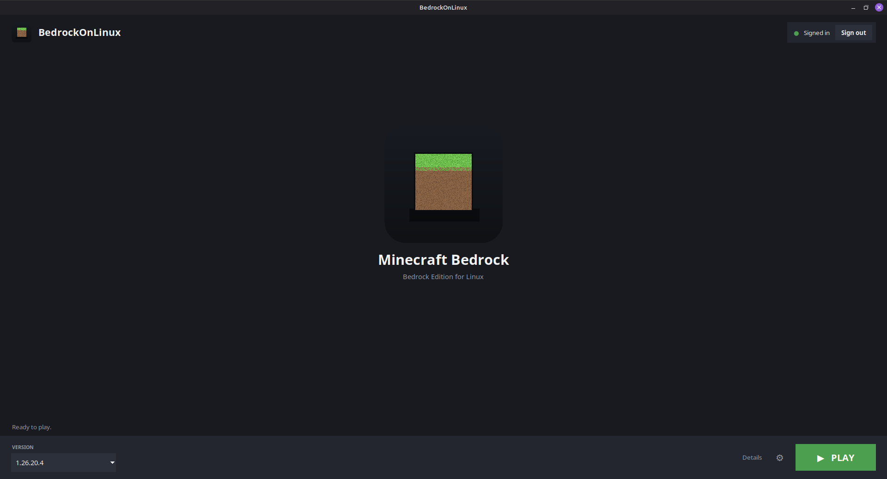

<div align="center">

# 🟩 BedrockOnLinux

**Minecraft Bedrock (Windows / GDK edition) on Linux, with native in-game
Microsoft sign-in and multiplayer. Install it, pick a version, play.**

`Ubuntu` · `Debian` · `Linux Mint / LMDE` · `Fedora` · `Arch` · `openSUSE`



</div>

---

## What it does

One app, everything automatic:

- downloads the Minecraft version you pick;
- builds and runs **GDK-Proton** from a **WineGDK** fork that implements
  `XUser` + request signing, so you sign in to **Microsoft inside the game**
  — no relay, no proxy;
- applies the binary patches the game needs to start and to join online
  Bedrock servers;
- fixes curl/SSL and `options.txt`, then launches the game.

You then play like on any platform: sign in, open **Play ▸ Servers**, and
join native Bedrock servers (Hive, CubeCraft, …) or crossplay/Geyser servers.

## Install

**Debian / Ubuntu / Mint** — `.deb`

```bash
sudo apt install ./bedrock-on-linux_*_all.deb
```

**Any distro** — AppImage

```bash
chmod +x BedrockOnLinux-*-x86_64.AppImage && ./BedrockOnLinux-*-x86_64.AppImage
```

**Portable** — tarball

```bash
tar xzf bedrock-on-linux-*-portable.tar.gz && cd bedrock-on-linux
./bedrock-on-linux gui
```

> Needs: `python3`, `python3-tk`, `tar`, `zstd`.
> `bedrock-on-linux doctor` reports anything missing.

## Play

1. Open **BedrockOnLinux**.
2. Top-right **Sign in** — open the shown link, enter the code, and sign in
   with the account that owns Minecraft.
3. Pick a **version** (bottom-left), then hit **▶ PLAY**.
4. In game: **Play ▸ Servers** (or *Discover*) and join.

The first **PLAY** downloads the version and builds the engine (once); after
that it just starts. Everything else is handled for you.

## The engine build (first run)

The first launch builds the WineGDK-based GDK-Proton. This is a full Wine
build — it is **long** and needs build tools; the launcher checks for them
and prints exactly what to install (e.g. `sudo apt build-dep wine` +
`flex bison gcc-mingw-w64-x86-64 …`). Builds are cached by source commit, so
it only happens once per engine update.

## Command line

```bash
bedrock-on-linux              # open the launcher (same as 'gui')
bedrock-on-linux versions     # list available Minecraft versions
bedrock-on-linux setup --mc 1.26.21.1   # download + prepare a version
bedrock-on-linux login        # sign in to a Microsoft account
bedrock-on-linux play         # launch
bedrock-on-linux repair       # reset a broken Wine prefix
bedrock-on-linux doctor       # check host requirements
```

## If something fails

Use **⚙ Settings ▸ Open logs folder**
(`~/.local/share/bedrock-on-linux/logs/`), or **⚙ Settings ▸ Repair** to
rebuild a broken Wine prefix. The live step-by-step log is also under
**Details** in the launcher.

## Legal

BedrockOnLinux ships **no Minecraft files** — it is a compatibility launcher.
Game files come from a source you choose (default: the community archive
[`bubbles-wow/mcbe-gdk-unpack-archive`](https://github.com/bubbles-wow/mcbe-gdk-unpack-archive))
or your own folder; **you must own Minecraft**. GDK-Proton and WineGDK are
free software under their own licenses. Realms is not supported.

## Build

```bash
scripts/build-release.sh        # .deb + AppImage + portable tarball → dist/
```

## License

MIT — see [`LICENSE`](LICENSE).
